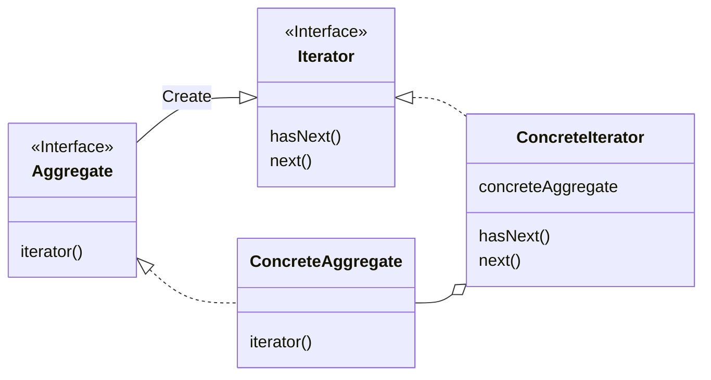
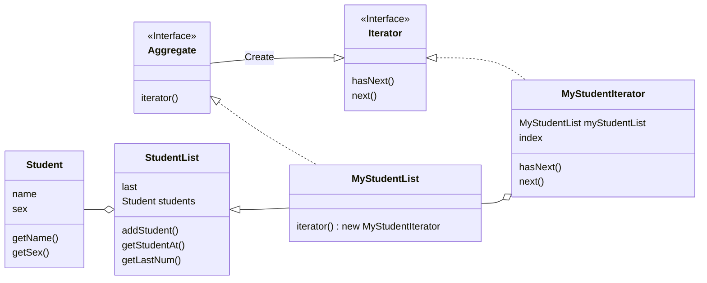

# Iterator Pattern

The Iterator pattern is a pattern that provides a way to access each element of an object that holds a collection of elements in sequence

## Class Diagram

General class diagram of the Iterator pattern

### Class Diagram for example

