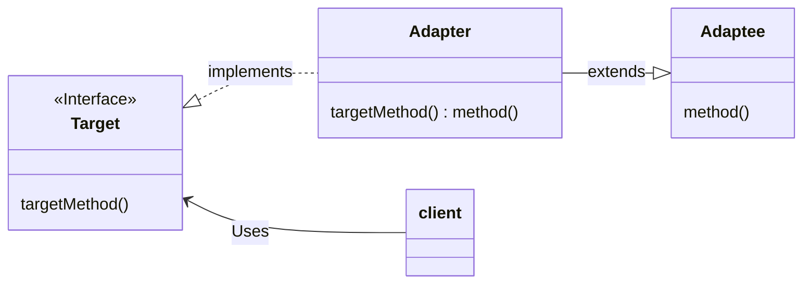
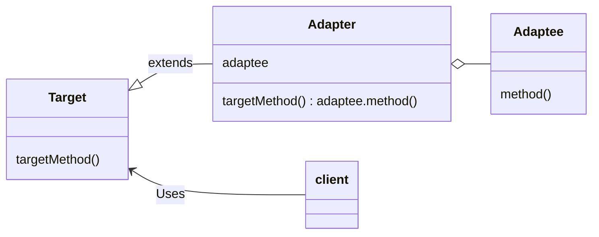

# Adapter Pattern

The Adapter pattern is a pattern that aims to combine classes that are incompatible with each other in the interface

## Class Diagram

General class diagram of the Iterator pattern

### using inheritance

General class diagram of Adapter pattern using inheritance

### using delegation

General class diagram of Adapter pattern using delegation

