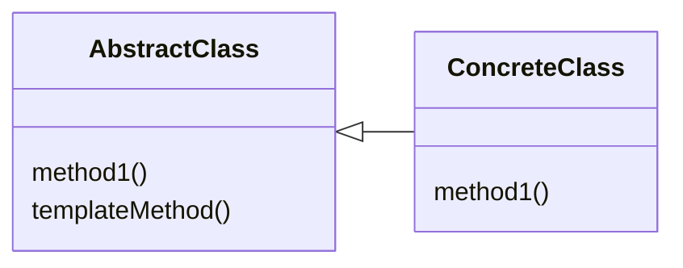

# TemplateMethod Pattern

The TemplateMethod pattern is a pattern that has the function of a template

## Class Diagram

General class diagram of the TemplateMethod pattern

```mermaid
classDiagram
    direction LR
    class AbstractClass    {
        method1()
        templateMethod()
    }
    class ConcreteClass{
        method1()
    }
    AbstractClass <|-- ConcreteClass
```
