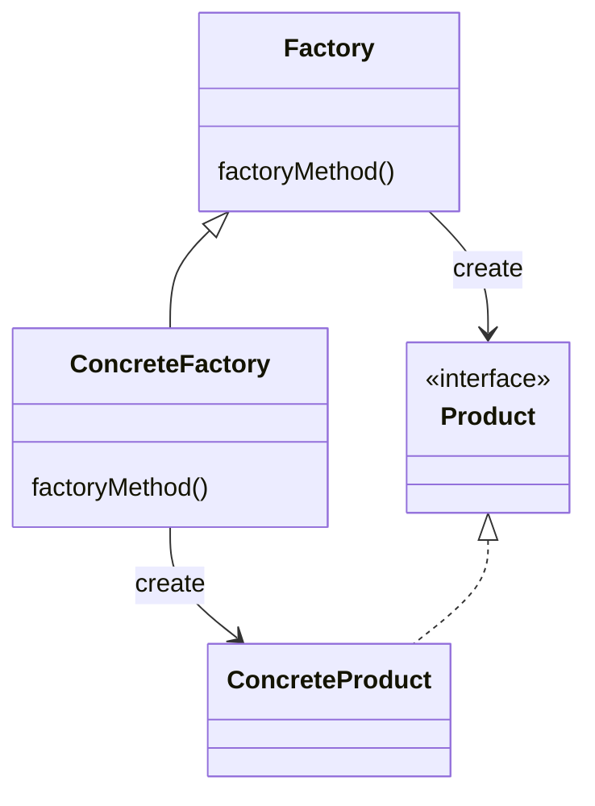

# FactoryMethod Pattern

The FactoryMethod pattern aims to create objects more flexibly by adding some ideas to the method of creating objects

## Class Diagram

General class diagram of the FactoryMethod pattern

