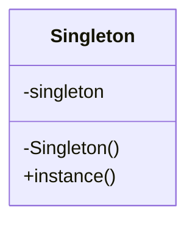

# Singleton Pattern

The Singleton pattern is a pattern that guarantees a unique existence

## Class Diagram

General class diagram of the Singleton pattern

```mermaid
classDiagram
    class Singleton    {
        -singleton
        -Singleton()
        +instance()
    }
```
