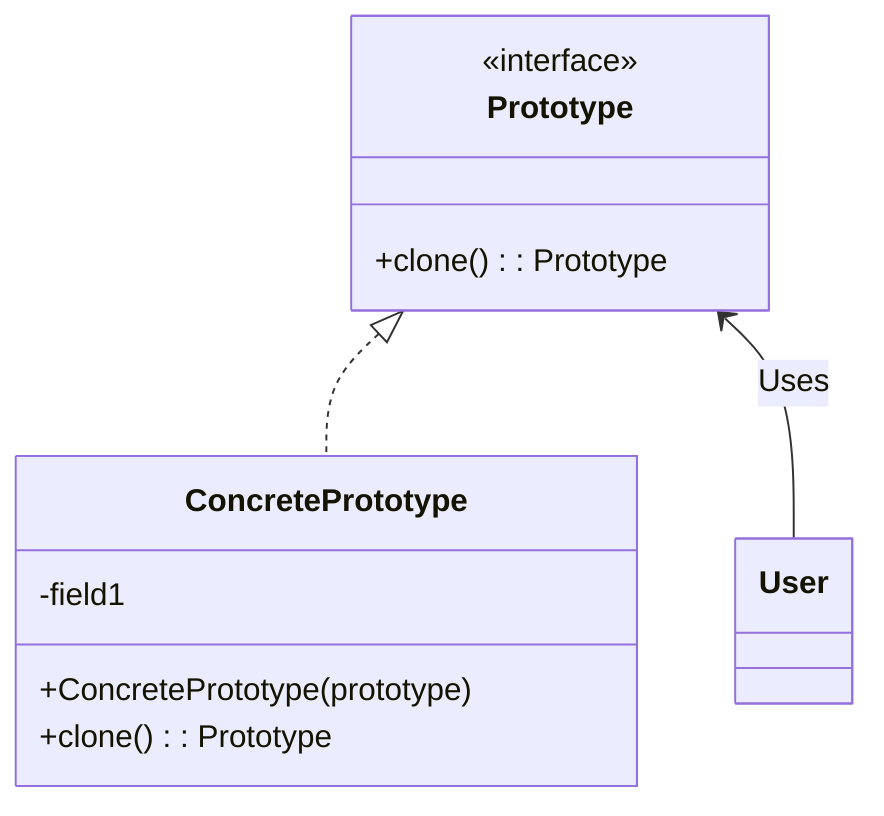

# Prototype Pattern

The Prototype pattern is a pattern for creating an instance from a prototype prepared in advance

## Class Diagram

General class diagram of the Prototype pattern

```mermaid
classDiagram
    class Prototype {
        <<interface>>
        +clone() : Prototype
    }
    class ConcretePrototype{
        -field1
        +ConcretePrototype(prototype)
        +clone() : Prototype
    }
    Prototype <|.. ConcretePrototype
    Prototype <-- User : Uses
```
