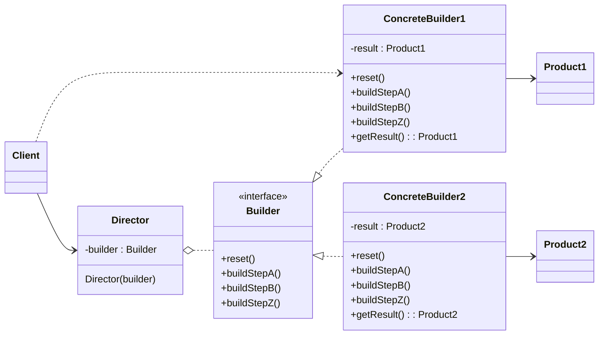

# Builder Pattern

The Builder pattern is a pattern for obtaining results in different expressions in the same creation process

## Class Diagram

General class diagram of the Builder pattern

```mermaid
classDiagram
    direction LR
    class Builder {
        <<interface>>
        +reset()
        +buildStepA()
        +buildStepB()
        +buildStepZ()
    }
    class Director{
        -builder : Builder
        Director(builder)
    }
    class ConcreteBuilder1{
        -result : Product1
        +reset()
        +buildStepA()
        +buildStepB()
        +buildStepZ()
        +getResult() : Product1
    }
    class ConcreteBuilder2{
        -result : Product2
        +reset()
        +buildStepA()
        +buildStepB()
        +buildStepZ()
        +getResult() : Product2
    }
    Director o..  Builder
    Builder <|.. ConcreteBuilder1
    Builder <|.. ConcreteBuilder2
    ConcreteBuilder1 --> Product1
    ConcreteBuilder2 --> Product2
    Client --> Director
    Client ..> ConcreteBuilder1

```
